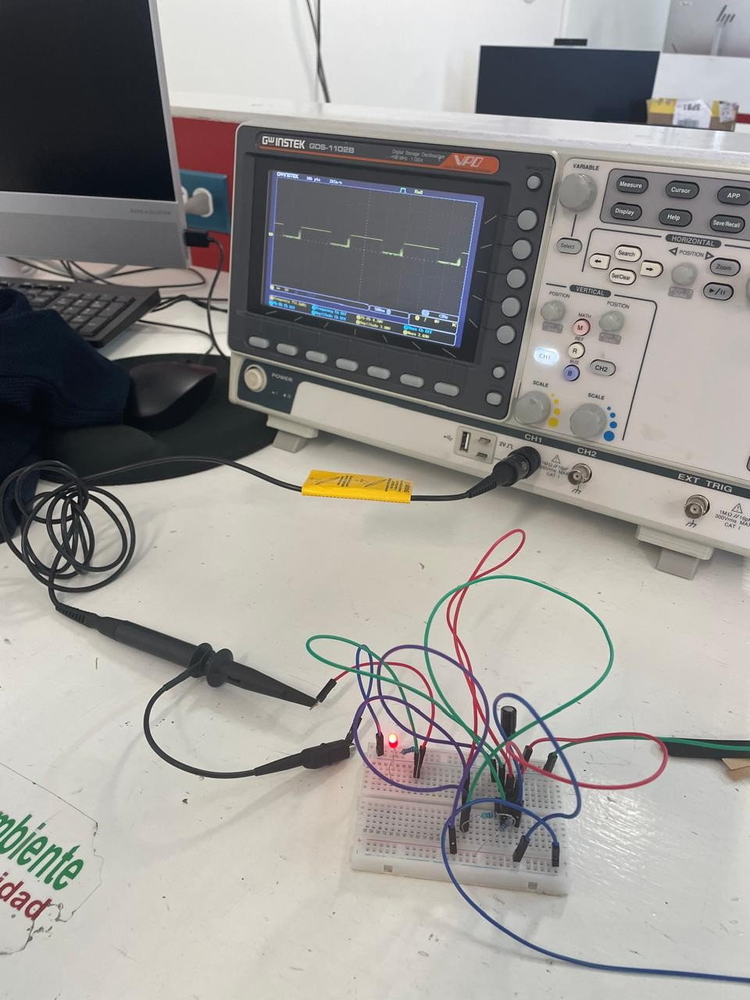
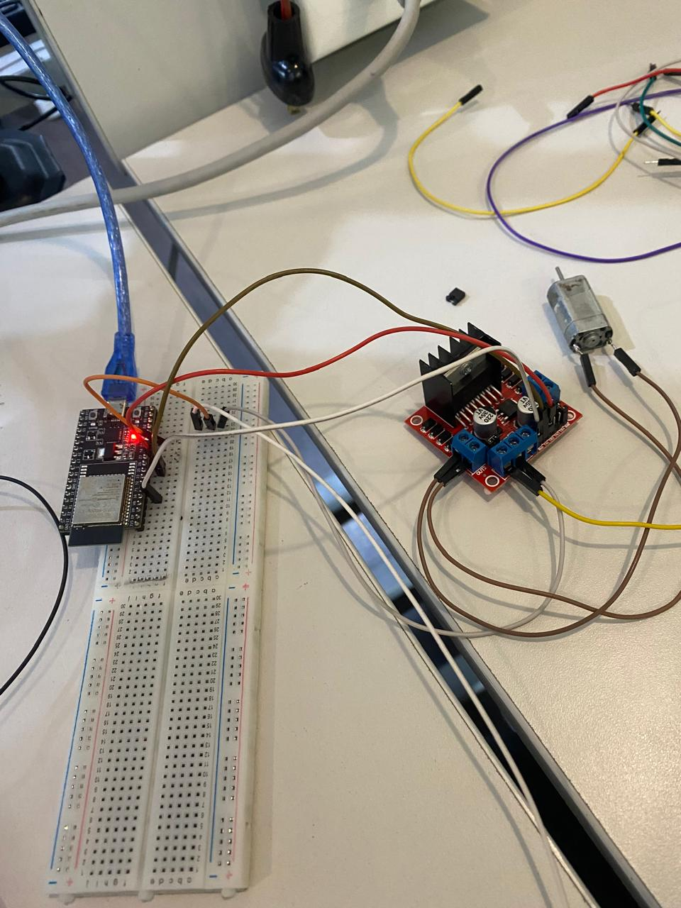

# **Practicas de clase**
---
## **Practica 1 - Encendido de LED**

### Introduccion y Objetivos

La práctica se enmarcó dentro de la materia de Introducción a la Mecatrónica y tuvo como finalidad el estudio y la aplicación del circuito integrado temporizador 555. El manejo de temporizadores y la generación de señales de reloj son fundamentales para el diseño de sistemas de control y automatización.

- Los objetivos principales de esta práctica fueron:

Comprender el principio de funcionamiento del circuito integrado 555 en su configuración astable.
 * Diseñar e implementar un circuito intermitente capaz de controlar el encendido y apagado de un LED.
 * Calcular y ajustar los componentes pasivos ($R_1$, $R_2$ y $C_1$) para lograr un periodo de oscilación total (T) entre 1 y 5 segundos.


### Marco Teorico

**Circuito Integrado 555 (Modo Astable):**

El 555 en modo astable opera como un multivibrador auto-oscilante, lo que significa que su salida (Pin 3) conmuta continuamente entre el estado ALTO y BAJO sin necesidad de una entrada externa. El tiempo que permanece en cada estado lo define la carga y descarga del capacitor a través de las resistencias.

**Fórmulas de Cálculo y Componentes:**

El diseño se basa en las siguientes ecuaciones, donde los valores utilizados son: 

- $R1 = 1 \text{ k}\Omega$, 
- $R_2 = 35 \text{ k}\Omega$
- $C_1 = 100 \mu F$:

Formulas:

- $T_{OFF}$ (Tiempo de Apagado): $0.693 \times R_2 \times C_1$
- $T_{ON}$ (Tiempo de Encendido): $0.693 \times (R_1 + R_2) \times C_1$
- $T$ (Período Total): $0.693 \times (R_1 + 2R_2) \times C_1$


### Procedimiento

- Materiales y Equipo
  * Circuito Integrado 555
  * LED 
  * Resistencias de 1 y de 35
  * Capacitor de 100 Uf
  * Fuente de alimentación (VCC).
  * Protoboard y cables de conexión.
  * Osciloscopio y/o cronómetro (para verificación).

**Procedimiento de Montaje**

1.- Cálculo: Se verificó el valor teórico del período con los componentes seleccionados, obteniendo $T \approx \mathbf{4.92 \text{ segundos}}$.

2.-Cableado del CI: El CI 555 se colocó en la protoboard. Los Pines 8 (VCC) y 4 (Reset) se conectaron a VCC y los Pines 1 (GND) y 5 (Control) se conectaron a tierra (el Pin 5 con el filtro $C_2$).

3.- Red RC (Temporización):
- $R_1$ ($\mathbf{1 \text{ k}\Omega}$) se conectó entre VCC y el Pin 7 (Discharge).
- $R_2$ ($\mathbf{35 \text{ k}\Omega}$) se conectó entre el Pin 7 y los Pines 6 y 2 (unidos).
- $C_1$ ($\mathbf{100 \mu F}$) se conectó desde los Pines 6/2 a tierra.

4.- Salida: El Pin 3 (Output) se conectó a la resistencia limitadora $R_4$ ($\mathbf{1 \text{ k}\Omega}$), y esta al ánodo del LED, cuyo cátodo fue a tierra.

5.-Verificación: Se aplicó la fuente de alimentación para observar el parpadeo del LED y se utilizó el osciloscopio para medir el período de la señal.


### Resultados

Tiempo de Apagado ($T_{OFF}$): 2.43 segundos

Tiempo de Encendido ($T_{ON}$): 2.49 segundos

Período Total ($T$): 4.92 segundos


### Conclusion

La práctica fue exitosa al implementar el oscilador Astable utilizando el CI 555 y demostró la capacidad de controlar el tiempo de un circuito analógico mediante la correcta selección de la red RC. El uso de $R_2 = 35 \text{ k}\Omega$ y $C_1 = 100 \mu F$ produjo un parpadeo lento con un período cercano a $\mathbf{2 \text{ segundos}}$ entre encendido y apagado.

-

-[Video de Encendio del Led](recursos/archivos/practica1video.mp4)


## **Practica 2 - Encendido y apagado de LED con ESP32**

### Introduccion y Objetivos

Esta práctica es fundamental en la introducción a los sistemas embebidos y la Mecatrónica. Se centra en el control digital más básico: el manejo de una salida (output) mediante un microcontrolador. Se utilizó el ESP32 para controlar directamente un Diodo Emisor de Luz (LED), confirmando el correcto funcionamiento de los pines.

Los objetivos principales de esta práctica fueron:

 - Establecer la comunicación y programación del microcontrolador ESP32.
 - Implementar un control digital ON/OFF (encendido y apagado) para el estado del LED.


### Marco Teorico


**Microcontrolador ESP32El** 

ESP32 es la placa de desarrollo utilizada para alojar y ejecutar el código de control. Sus pines de GPIO (General-Purpose Input/Output) pueden ser configurados para funcionar como salidas que aplican un voltaje (estado ALTO, generalmente $3.3 \text{V}$) o $0 \text{V}$ (estado BAJO).


**Control Digital ON/OFF**

El LED se controla mediante una lógica digital simple:

Estado ALTO (1): El pin GPIO suministra voltaje, y el LED se enciende.
Estado BAJO (0): El pin GPIO se pone a $0 \text{V}$, y el LED se apaga.


**Funciones Clave**

El código utiliza tres funciones principales del entorno de Arduino:

`pinMode(pin, OUTPUT)`: Configura el pin seleccionado (led = 13) para que funcione como una salida de voltaje.

`digitalWrite(pin, value)`: Envía una señal digital (ALTO o BAJO) al pin.

`delay(ms)`: Pausa la ejecución del código por el número de milisegundos (ms) especificado, estableciendo la temporización del parpadeo.


### Procedimiento

**Materiales y Equipo**
  * Microcontrolador ESP32
  * LED
  * Resistencias
  * Cables Jumpers
  * Protoboards
  * Computadora con IDE de Arduino

**Procedimiento para conexion**

1.- Se conectó el pin ánodo (pata larga) del LED al pin GPIO 13 del ESP32, en serie con la resistencia limitadora.

2.- El cátodo (pata corta) del LED se conectó a la línea de tierra (GND) del ESP32.

3.- Subimos el codigo a la ESP32

```
const int led = 13;

void setup() {
  Serial.begin(115200);
  pinMode(led, OUTPUT);
}

void loop() {
  digitalWrite(led, 1);
  delay(1000);
  digitalWrite(led, 0);
  delay(1000);
}

```


### Resultados

La actividad fue completamente exitosa y demostró el control digital del microcontrolador.

- Comportamiento Observado: El LED comenzó a parpadear de forma rítmica e ininterrumpida tan pronto como se cargó el código.
- Temporización: El tiempo de encendido fue de $\mathbf{1}$ segundo y el tiempo de apagado fue de $\mathbf{1}$ segundo, cumpliendo con la temporización programada en el código.


### Conclusion

Concluyó con éxito, demostrando el control esencial de las salidas digitales del ESP32. Se logró programar un parpadeo intermitente con un periodo de 2 segundos (1 s encendido, 1 s apagado). El principal aprendizaje fue la correcta aplicación de pinMode() para la configuración y digitalWrite() para la conmutación de estados


## **Practica 3- Encendido de LED con ESP32 y un botón**

### Introducción

El objetivo fue establecer la comunicación bidireccional entre el ESP32 y el mundo exterior, utilizando un botón pulsador como entrada digital para gestionar directamente el estado de un LED como salida.

**Objetivos**

Los objetivos principales de esta actividad fueron:

 - Configurar un pin GPIO del ESP32 como entrada para leer el estado del botón.
 - Configurar otro pin GPIO como salida para controlar el LED.
 - Implementar la lógica de control para que el LED se encienda únicamente cuando se detecte la pulsación del botón (estado ALTO).


### Marco Teorico

**Microcontrolador ESP32**

El ESP32 es el sistema de control que aloja el código. El núcleo de la práctica es el manejo de los pines GPIO (Entrada/Salida de Propósito General), que pueden ser configurados de dos formas:

- Salida (OUTPUT): Envía una señal (voltaje) para controlar el LED.
- Entrada (INPUT): Lee el voltaje aplicado externamente por el botón.


**Botón Pulsador y Resistencia Pull-down**

El Botón Pulsador actúa como un interruptor. Al ser presionado, conecta el pin de entrada (GPIO 34) a la fuente de voltaje ($3.3 \text{V}$), lo que genera la señal ALTO (1) que el ESP32 debe leer. Idealmente, se usa una resistencia pull-down para asegurar que el pin siempre lea BAJO (0) cuando el botón está liberado, evitando lecturas erróneas.

### Procedimiento

**Materiales**

 - Microcontrolador ESP32
 - LED
 - Resistencia limitadora (para el LED)
 - Resistencia Pull Down 
 - Botón Pulsador de cuatro patas.
 - Cables Jumper
 - Protoboard.
 - Computadora con Arduino IDE 

**Procedimiento de la conexion**

1.- Conexión del LED: 

-El LED se conecta al pin 33, con su resistencia limitadora a GND.

2.- Conexión del Botón:

- Un terminal del botón se conecta al pin 34.
- Otro terminal del botón se conecta a la fuente de voltaje (3.3V).
- Se conecta una resistencia del pin  34 a Tierra (GND).

3.- Generamos el codigo y se lo subimos a la ESP32:

```
const int led = 33;
const int btn = 34;

void setup() {
  Serial.begin(115200);
  pinMode(led, OUTPUT);
  pinMode(btn, INPUT);
}

void loop() {
  int estado = digitalRead(btn);
  if (estado == 1) {
    digitalWrite(led, 1);
  } else {
    digitalWrite(led, 0);
  }
}

```

### Resultados

La actividad fue exitosa, estableciendo un control directo y en tiempo real sobre el LED. El LED permaneció apagado mientras el botón estaba en reposo. Al presionar y mantener el botón, el LED se encendió de forma inmediata. Al soltar el botón, el LED se apagó de forma instantánea.


### Conclusion

La práctica fue exitosa al implementar el control de un LED mediante una entrada digital, consolidando el uso del ESP32 para la interacción en tiempo real. Se demostró la capacidad de leer el estado de un interruptor `(digitalRead)` y usar esa información para controlar una salida `(digitalWrite)`


## **Practica 4 - Encendido de Led con ESP32 y Bluetooth**

### Introduccion

Esta práctica marca la transición del control local (botones, temporización) al control remoto inalámbrico, utilizando la capacidad nativa de Bluetooth del microcontrolador ESP32. El objetivo fue establecer una comunicación serial a través de Bluetooth para enviar comandos simples de texto  desde un dispositivo externo (como un smartphone) y gestionar remotamente el estado de un LED.


### Marco Teorico

**Bluetooth Serial (SPP)**

El ESP32 soporta múltiples protocolos, incluyendo Bluetooth Clásico para la comunicación Serial Profile (SPP). Esto permite que el ESP32 se comunique como un dispositivo de puerto serie virtual, siendo detectado y emparejado como un módulo Bluetooth tradicional (como el HC-05). La librería BluetoothSerial.h facilita esta funcionalidad, permitiendo enviar y recibir datos como si fuera una conexión serial por cable.

**Comunicación Inalámbrica**

El control se basa en la recepción de datos sin contacto físico.

- `SerialBT.begin()`: Asigna un nombre (en el código, "Sam_ESP32") para que el dispositivo sea visible y se pueda emparejar.

- `SerialBT.available()`: Es la función clave que verifica continuamente si hay comandos (datos) pendientes en el buffer de recepción inalámbrico.

- `SerialBT.readString()`: Lee la cadena de texto completa enviada por el dispositivo remoto (el comando).


### Procedimiento

**Materiales**

- Microcontrolador ESP32
- LED
- Resistencia limitadora.
- Cables Jumper
- Protoboard.
- Dispositivo Remoto: Un smartphone o computadora con capacidad Bluetooth y una aplicación de terminal Serial Bluetooth para enviar los comandos

**Procedimiento de conexion de cables y programación**

1.- Los cables se mantienen conectados de la misma manera que en la practica anterior, solo cambiamos el codigo

2.- Generamos el codigo y lo subimos a la ESP32:

```
#include "BluetoothSerial.h"
BluetoothSerial SerialBT;

const int led = 33;

void setup() {
  Serial.begin(115200);
  SerialBT.begin("AbrahamESP32"); // Nombre del dispositivo Bluetooth
  pinMode(led, OUTPUT);
}

void loop() {
  if (SerialBT.available()) {
    String mensaje = SerialBT.readString();
    Serial.println("Recibido: " + mensaje);

    if (mensaje == "ON") {
      digitalWrite(led, HIGH);
    } else if (mensaje == "OFF") {
      digitalWrite(led, LOW);
    }
  }
  delay(100);
}

```
3.- Con la aplicacion concetamos el celular via Bluetooth a la ESP32 y comprobamos que al escirbir "ON" se enciende y al escribir "OFF" se apaga el LED.


### Resultados 

**Conectividad:** 

El dispositivo "AbrahamESP32" fue detectado y se pudo establecer el emparejamiento desde el dispositivo remoto.

**Comportamiento del LED:**

- Al enviar el mensaje exacto "ON" desde la terminal Bluetooth, el LED se encendió.
- Al enviar el mensaje exacto "OFF", el LED se apagó.
- Cualquier otro comando o variación de texto no generó ninguna acción, confirmando la sensibilidad del código a la coincidencia exacta de la cadena de texto.


### Conclusion

Concluyó exitosamente con la implementación del control remoto de un LED mediante Bluetooth Serial en el ESP32. Se logró configurar el enlace inalámbrico y demostrar la capacidad del microcontrolador para procesar comandos de texto recibidos por aire para manipular una salida digital.


## **Practica 5- Movimiento de motores con ESP32**

### Introduccion

La práctica tuvo como objetivo principal la integración de un sistema embebido (ESP32) con un sistema de actuación (motor DC) utilizando un módulo controlador Puente H. Esta práctica es fundamental en el campo de la Mecatrónica, ya que establece las bases para el control de movimiento y la dirección de actuadores en sistemas automatizados y robótica.

- Objetivos:

- Los objetivos principales de esta práctica fueron:
 - Establecer la comunicación y el control de un motor de corriente continua (DC) mediante el microcontrolador ESP32 y un driver de motor.
 - Implementar el control de dirección del motor, logrando que gire en un sentido, se detenga y luego gire en el sentido opuesto.
 - Programar y controlar la temporización de cada estado de movimiento (avance, paro y reversa) utilizando funciones de retardo (delay).

### Marco Teorico

- Motores DC (Actuador):-
El Motor de Corriente Continua (DC) es el componente que convierte la energía eléctrica en movimiento mecánico. Su característica esencial en esta práctica es que su dirección de giro está determinada por la polaridad del voltaje que se le aplica a sus terminales.

- Driver de Motor (Puente H):-
El circuito Puente H es un módulo de potencia indispensable que actúa como intermediario. Su función principal es doble: primero, suministrar la alta corriente necesaria para el motor utilizando una fuente externa (ya que el ESP32 no puede hacerlo); y segundo, controlar la dirección del motor. El Puente H invierte la polaridad del voltaje aplicado al motor según las señales lógicas que recibe.

- Interconexión y Control Lógico:-
La interconexión se establece utilizando los pines del ESP32 para enviar señales de control al Puente H. Específicamente, dos pines del ESP32 (in1 e in2) se conectan a las entradas lógicas del Puente H.


### Procedimiento

**Materiales y Equipo**

 - Microcontrolador ESP32
 - Motor de Corriente Continua
 - Módulo Puente H
 - Protoboard
 - Cables Jumper
 - Fuente de Alimentación Externa (para el motor)
 - Computadora con IDE de Arduino
 - Cable USB (para el ESP32)

**Procedimiento**
  
- Montaje y Conexión del Hardware
     
1.- Conexión del Driver de Potencia: Conecta los pines de control lógico del Driver de Motor (Puente H) a los pines digitales del ESP32.
 - Conectar el pin de entrada 1 del driver al pin 25 (in1).
 - Conectar el pin de entrada 2 del driver al pin 26 (in2).

2.- Conexión del Motor: Conectar las dos terminales del Motor DC a las terminales de salida del Driver de Motor.

3.- Alimentación: Conectar la fuente de alimentación externa al pin de voltaje del Driver de Motor.
 - Asegúrarnos de que la tierra (GND) del ESP32 esté conectada a la tierra (GND) del Driver de Motor y de la fuente externa (tierra común).

4.- Alimentación Lógica: Conectar el ESP32 a la computadora mediante el cable USB para la alimentación lógica y la carga del código.

5.- Subimo el codigo a la ESP32
 
```cpp
#define in1 25
#define in2 26

void setup() {
  pinMode(in1, OUTPUT);
  pinMode(in2, OUTPUT);
}

void loop() {

    digitalWrite(in1, 1); 
    digitalWrite(in2, 0); 
    delay(3000);
    digitalWrite(in1, 0); 
    digitalWrite(in2, 0); 
    delay(1000);
    digitalWrite(in1, 0); 
    digitalWrite(in2, 1); 
    delay(1000); 
  }

```


### Resultados

El circuito implementado con el ESP32 ejecutó la secuencia programada, logrando el control de la dirección y la temporización del motor.

- Sentido 1 (Avance/Giro): El motor giró en la primera dirección durante 3 segundos (delay(3000)).
- Paro por Inercia: El motor se detuvo por completo por inercia durante 1 segundo (delay(1000)).
- Sentido 2 (Reversa/Contragiro): El motor giró en la dirección opuesta durante 1 segundo (delay(1000)).


### Conclusion

La práctica fue exitosa al demostrar el control básico de dirección y temporización de un motor DC utilizando el ESP32 y un driver Puente H. Se logró controlar la dirección de giro y la duración de cada estado (avance, paro y reversa) mediante los comandos digitalWrite() y delay(). Esto confirmó la comprensión de la lógica del driver y la capacidad del ESP32 para manejar la actuación.


-
-
-
-

-[Video de Encendidi de Motores con ESP32](recursos/archivos/practicamotores.mp4)


## **Practica 6 - Aceleracion y desaceleracion de motores con ESP32**

### Introduccion

La Práctica de Control de Velocidad con ESP32 tuvo como enfoque principal la aplicación de la Modulación por Ancho de Pulso (PWM) para lograr un control fino y gradual del movimiento de un motor de corriente continua (DC). El objetivo fue ir más allá del control simple de encendido/apagado para implementar una variación dinámica de la velocidad.

- Objetivos:

Los objetivos principales de esta práctica fueron:
   - Configurar y utilizar el hardware de PWM del microcontrolador ESP32 para generar una señal de velocidad.
   - Implementar un algoritmo que permita al motor acelerar progresivamente hasta su velocidad máxima.
   - Implementar un algoritmo que, al alcanzar la velocidad máxima o un umbral predefinido, inicie una desaceleración o un cambio en la rampa de velocidad.

### Marco Teorico

- Motores DC (Actuador):

El Motor DC es el actuador cuya velocidad se controla. Su velocidad de rotación es directamente proporcional al voltaje promedio que recibe. La dirección de giro se mantiene fija en esta práctica mediante una polaridad constante.

- Driver de Motor (Puente H)

El Driver de Motor (Puente H) es esencial para suministrar la alta corriente que el ESP32 no puede proveer. En esta práctica, el Puente H cumple dos funciones:

 - Control de Dirección: Los pines in1 y in2 se fijan en un estado lógico (1 y 0) para mantener una dirección constante.
 - Control de Velocidad: El pin PWM del ESP32 se conecta al pin de Enable del driver para modular el voltaje promedio que llega al motor.

- Modulación por Ancho de Pulso (PWM):

El PWM es la técnica central para el control de velocidad. El ESP32 utiliza la API ledc para generar una señal digital cuyo ciclo de trabajo (el tiempo que la señal está en ALTO) varía.

 - ledcAttachChannel(pin, freq, bits, channel): Inicializa un canal PWM. En el código, la resolución de 8 bits define que la velocidad varía de $0$ (apagado) a $255$ (máximo).
  
 - ledcWrite(): Es la función que establece el ciclo de trabajo, controlando directamente la velocidad del motor.


### Procedimiento

**Materiales y Equipo**

 - Microcontrolador ESP32 
 - Motor de Corriente Continua 
 - Módulo Puente H
 - Protoboard
 - Cables Jumper
 - Fuente de Alimentación Externa (para el motor)
 - Computadora con IDE de Arduino
 - Cable USB (para el ESP32)

**Procedimiento**

- Montaje y Conexión del Hardware
     
1.- Conexión del Driver de Potencia: Conecta los pines de control lógico del Driver de Motor (Puente H) a los pines digitales del ESP32.
 - Conectar el pin de entrada 1 del driver a pin 32 (in1).
 - Conectar el pin de entrada 2 del driver a pin 33 (in2).

2.- Conexión del Motor: Conectar las dos terminales del Motor DC a las terminales de salida del Driver de Motor.

3.- Conexión PWM: El pin 25 (definido implícitamente por el canal 0 en ledcAttachChannel) o un pin equivalente (esto debe revisarse, ya que ledcWrite usa el número de canal o el pin) se conecta al pin de Enable/Velocidad del driver.

4.- Alimentación: Conectar la fuente de alimentación externa al pin de voltaje del Driver de Motor.
 - Asegúrarnos de que la tierra (GND) del ESP32 esté conectada a la tierra (GND) del Driver de Motor y de la fuente externa (tierra común).

5.- Alimentación Lógica: Conectar el ESP32 a la computadora mediante el cable USB para la alimentación lógica y la carga del código.


6.- Subimos el codigo a la ESP32
 
```cpp
#define in1 32
#define in2 33
int var=20;
 
void setup() {
 
  pinMode(in1, OUTPUT);
  pinMode(in2, OUTPUT);
  ledcAttachChannel(25, 1000, 8 , 0);
  Serial.begin(115200);
 
 
}
 
void loop() {
  Serial.println(var);
  ledcWrite(25, var);
  digitalWrite(in1,1);
  digitalWrite(in2,0);
  delay(1000);
  var=var+20;
  if(var>255){
     var=var-80;
  }  
  delay(1000);
 
}

```


### Resultados

- Aceleración: El motor aumentó su velocidad en pasos de 20 unidades de PWM cada 2 segundos.

- Desaceleración/Salto: En lugar de una desaceleración gradual, se observó un salto repentino a una velocidad menor cuando el contador var superó 255, seguido de una nueva aceleración.

- Dirección: La dirección de giro se mantuvo fija durante todo el experimento.

### Conclusion

La práctica fue exitosa en la implementación de PWM para el control de velocidad del motor DC con el ESP32. Se logró un control dinámico donde el motor aceleró continuamente. El principal aprendizaje fue el uso de la función ledcWrite() para modular la velocidad y la importancia de la resolución de 8 bits (0-255). Sin embargo, el mecanismo implementado para manejar el exceso de velocidad (la caída de 80 unidades) resultó en un salto brusco de velocidad, no en una desaceleración progresiva y suave.


