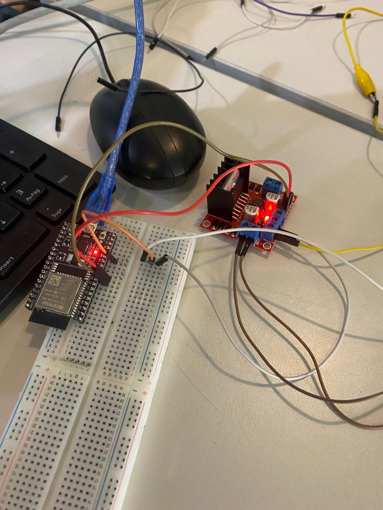

# **Practicas de clase**
---
## **Practica 1 - Encendido de LED**

### Introduccion y Objetivos

La práctica se enmarcó dentro de la materia de Introducción a la Mecatrónica y tuvo como finalidad el estudio y la aplicación del circuito integrado temporizador 555. El manejo de temporizadores y la generación de señales de reloj son fundamentales para el diseño de sistemas de control y automatización.

- Objetivos

Los objetivos principales de esta práctica fueron:

1.-Comprender el principio de funcionamiento del circuito integrado 555 en su configuración astable.

2.-Diseñar e implementar un circuito intermitente capaz de controlar el encendido y apagado de un LED.

3.-Calcular y ajustar los componentes pasivos ($R_1$, $R_2$ y $C_1$) para lograr un periodo de oscilación total (T) entre 1 y 5 segundos.


### Marco Teorico


### Procedimiento

- Materiales y Equipo
  * Circuito Integrado 555
  * LED 
  * Resistencias: $R_1 = 1 k\Omega$, $R_2 = 10 k\Omega$, $R_4 = 1 k\Omega$ (limitadora del LED).
  * Capacitor: $C_1 = 10 \mu F$, $C_2 = 0.01 \mu F$
  * Fuente de alimentación de $9V$ (VCC).
  * Protoboard y cables de conexión.
  * Osciloscopio y/o cronómetro (para verificación).


### Resultados


### Conclusion

- Descripción: Esta practica consisitio en llevar a cabo un circuito electrico utilizando un capacitor y un circuito integrado (chip 555) teniendo como objetivo encender y apagar una luz LED en un lapso de tiempo entre 1 a 5 segundos.

-


-[Video de Encendio del Led](recursos/archivos/practica1video.mp4)


## **Practica 2- Encendido de LED con ESP32**

- Descripción: 


## **Practica 3- Movimiento de motores con ESP32**

### Introduccion

La Práctica 3, "Movimiento de motores con ESP32", tuvo como objetivo principal la integración de un sistema embebido (ESP32) con un sistema de actuación (motor DC) utilizando un módulo controlador Puente H. Esta práctica es fundamental en el campo de la Mecatrónica, ya que establece las bases para el control de movimiento y la dirección de actuadores en sistemas automatizados y robótica.

- Objetivos:
  
 * Los objetivos principales de esta práctica fueron:
   1. Establecer la comunicación y el control de un motor de corriente continua (DC) mediante el microcontrolador ESP32 y un driver de motor.
   2. Implementar el control de dirección del motor, logrando que gire en un sentido, se detenga y luego gire en el sentido opuesto.
   3. Programar y controlar la temporización de cada estado de movimiento (avance, paro y reversa) utilizando funciones de retardo (delay).

### Marco Teorico

- Motores DC (Actuador)
El Motor de Corriente Continua (DC) es el componente que convierte la energía eléctrica en movimiento mecánico. Su característica esencial en esta práctica es que su dirección de giro está determinada por la polaridad del voltaje que se le aplica a sus terminales.

- Driver de Motor (Puente H)
El circuito Puente H es un módulo de potencia indispensable que actúa como intermediario. Su función principal es doble: primero, suministrar la alta corriente necesaria para el motor utilizando una fuente externa (ya que el ESP32 no puede hacerlo); y segundo, controlar la dirección del motor. El Puente H invierte la polaridad del voltaje aplicado al motor según las señales lógicas que recibe.

- Interconexión y Control Lógico
La interconexión se establece utilizando los pines del ESP32 para enviar señales de control al Puente H. Específicamente, dos pines del ESP32 (in1 e in2) se conectan a las entradas lógicas del Puente H.


### Procedimiento

- **Materiales y Equipo**

1.- Microcontrolador ESP32 
2.- Motor de Corriente Continua 
3.- Módulo Puente H
4.- Protoboard
5.- Cables Jumper
6.- Fuente de Alimentación Externa (para el motor)
7.- Computadora con IDE de Arduino
8.- Cable USB (para el ESP32)

- **Procedimiento**
  
1. Montaje y Conexión del Hardware
     
1.- Conexión del Driver de Potencia: Conecta los pines de control lógico del Driver de Motor (Puente H) a los pines digitales del ESP32.
 * Conectar el pin de entrada 1 del driver a GPIO 25 (in1).
 * Conectar el pin de entrada 2 del driver a GPIO 26 (in2).

2.- Conexión del Motor: Conectar las dos terminales del Motor DC a las terminales de salida del Driver de Motor.

3.- Alimentación: Conectar la fuente de alimentación externa (ej. 9V) al pin de voltaje del Driver de Motor.
 * Asegúrarnos de que la tierra (GND) del ESP32 esté conectada a la tierra (GND) del Driver de Motor y de la fuente externa (tierra común).

4.- Alimentación Lógica: Conectar el ESP32 a la computadora mediante el cable USB para la alimentación lógica y la carga del código.

5.- Subimo el codigo a la ESP32
 
```cpp
#define in1 25
#define in2 26

void setup() {
  pinMode(in1, OUTPUT);
  pinMode(in2, OUTPUT);
}

void loop() {

    digitalWrite(in1, 1); 
    digitalWrite(in2, 0); 
    delay(3000);
    digitalWrite(in1, 0); 
    digitalWrite(in2, 0); 
    delay(1000);
    digitalWrite(in1, 0); 
    digitalWrite(in2, 1); 
    delay(1000); 
  }

```


### Resultados

El circuito implementado con el ESP32 ejecutó la secuencia programada, logrando el control de la dirección y la temporización del motor.

- Sentido 1 (Avance/Giro): El motor giró en la primera dirección durante 3 segundos (delay(3000)).
- Paro por Inercia: El motor se detuvo por completo por inercia durante 1 segundo (delay(1000)).
- Sentido 2 (Reversa/Contragiro): El motor giró en la dirección opuesta durante 1 segundo (delay(1000)).


### Conclusion

La práctica fue exitosa al demostrar el control básico de dirección y temporización de un motor DC utilizando el ESP32 y un driver Puente H. Se logró controlar la dirección de giro y la duración de cada estado (avance, paro y reversa) mediante los comandos digitalWrite() y delay(). Esto confirmó la comprensión de la lógica del driver y la capacidad del ESP32 para manejar la actuación.


-
-
-
-

-[Video de Encendidi de Motores con ESP32](recursos/archivos/practicamotores.mp4)


## **Practica 4- Movimiento de servo-motores con ESP32**

### - 

- Descripción: 

