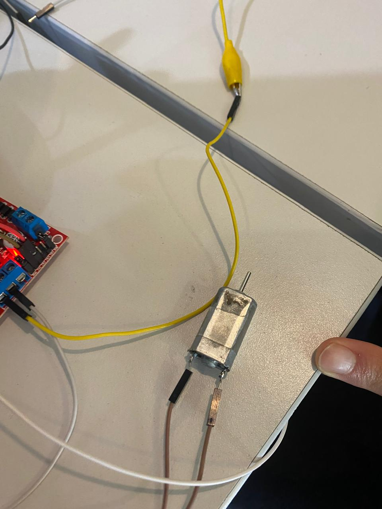

# **Practicas de clase**
---
## **Practica 1 - Encendido de LED**

### Introduccion y Objetivos

La práctica se enmarcó dentro de la materia de Introducción a la Mecatrónica y tuvo como finalidad el estudio y la aplicación del circuito integrado temporizador 555. El manejo de temporizadores y la generación de señales de reloj son fundamentales para el diseño de sistemas de control y automatización.

- Objetivos

Los objetivos principales de esta práctica fueron:

1.-Comprender el principio de funcionamiento del circuito integrado 555 en su configuración astable.

2.-Diseñar e implementar un circuito intermitente capaz de controlar el encendido y apagado de un LED.

3.-Calcular y ajustar los componentes pasivos ($R_1$, $R_2$ y $C_1$) para lograr un periodo de oscilación total (T) entre 1 y 5 segundos.

### Marco Teorico

### Procedimiento

- Materiales y Equipo
  * Circuito Integrado 555
  * LED 
  * Resistencias: $R_1 = 1 k\Omega$, $R_2 = 10 k\Omega$, $R_4 = 1 k\Omega$ (limitadora del LED).
  * Capacitor: $C_1 = 10 \mu F$, $C_2 = 0.01 \mu F$
  * Fuente de alimentación de $9V$ (VCC).
  * Protoboard y cables de conexión.
  * Osciloscopio y/o cronómetro (para verificación).

### Resultados

### Conclusion

- Descripción: Esta practica consisitio en llevar a cabo un circuito electrico utilizando un capacitor y un circuito integrado (chip 555) teniendo como objetivo encender y apagar una luz LED en un lapso de tiempo entre 1 a 5 segundos.

-

-[Video de Encendio del Led](recursos/archivos/practica1video.mp4)

## **Practica 2- Encendido de LED con ESP32**

- Descripción: 

## **Practica 3- Movimiento de motores con ESP32**

- Descripción: Esta practica consistio en el funcionamiento de motores, como usarlos con las ESP32 y el codigo para hacerlos funcionar,  en esta practica teniamos que hacer que el motor acelerara poco a poco hasta la velocidad maxima y que luego desacelerara poco a poco hasta que se parara.

-
-
-
-

-[Video de Encendidi de Motores con ESP32](recursos/archivos/practicamotores.mp4)

## **Practica 4- Movimiento de servo-motores con ESP32**

### - 

- Descripción: 

