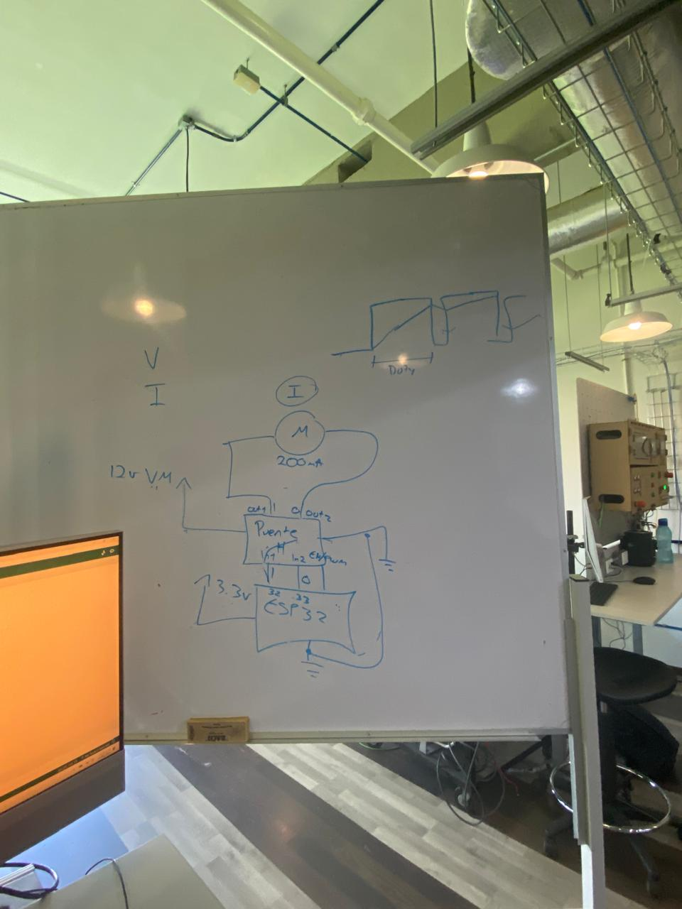

# **Practicas de clase**
---
## **Practica 1 - Encendido de LED**

- Descripción: Esta practica consisitio en llevar a cabo un circuito electrico utilizando un capacitor y un circuito integrado (chip 555) teniendo como objetivo encender y apagar una luz LED en un lapso de tiempo entre 1 a 5 segundos.

-

-[Video de Encendio del Led](recursos/archivos/practica1video.mp4)

## **Practica 2- Encendido de LED con ESP32**

- Descripción: 

## **Practica 3- Movimiento de motores con ESP32**

- Descripción: Esta practica consistio en el funcionamiento de motores, como usarlos con las ESP32 y el codigo para hacerlos funcionar,  en esta practica teniamos que hacer que el motor acelerara poco a poco hasta la velocidad maxima y que luego desacelerara poco a poco hasta que se parara.

-
-
-
-

-[Video de Encendio del Led](recursos/archivos/practicamotores.mp4)

## **Practica 4- Movimiento de servo-motores con ESP32**

### - 

- Descripción: 

