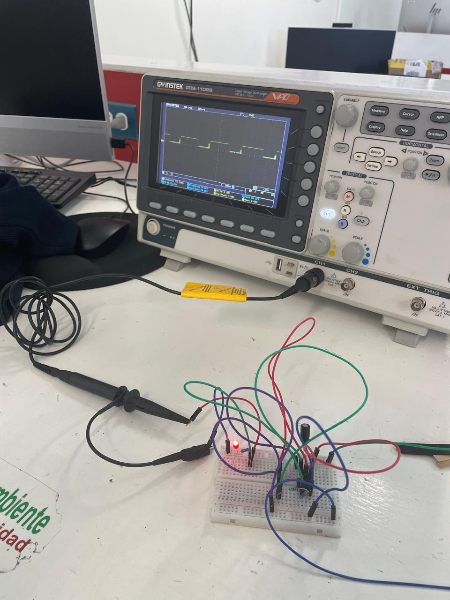

#PROYECTOS

## **Proyecto de mitad de semestre - Partido de coches**

### Introduccion

El presente proyecto se desarrolló en el marco del desafío de la asignatura, que consistía en diseñar y construir un vehículo teledirigido para la competencia de "Fútbol de Coches". El objetivo principal fue crear una plataforma móvil con el microcontrolador ESP32 capaz de ejecutar movimientos precisos (avance, retroceso y giro) controlados de forma inalámbrica. Esto garantizó una interfaz de usuario intuitiva y una alta maniobrabilidad necesaria en el campo de juego.

### Marco Teorico

1. Microcontrolador ESP32
Se eligió la ESP32 por su arquitectura de doble núcleo, alta velocidad de procesamiento y, crucialmente, su capacidad de comunicación inalámbrica integrada. Esta capacidad permitió la recepción de comandos en tiempo real desde el control de PlayStation, actuando como el cerebro del sistema para interpretar las señales y traducirlas en comandos de movimiento para los motores.

2. Driver de Motor L298N
El microcontrolador ESP32 no puede suministrar la corriente necesaria para mover los motores DC grandes. Por ello, se utilizó el módulo L298N, un driver de motor de puente H doble.

3. Control Inalámbrico (Mando de PlayStation y Bluetooth/Wi-Fi)
La comunicación se estableció mediante la vinculación del mando de PlayStation con la ESP32 (generalmente a través de Bluetooth o un protocolo de baja latencia similar), utilizando el entorno de programación de Arduino.

4. Tracción Diferencial
Para lograr el giro, se implementó un sistema de tracción diferencial controlando de manera independiente los dos motores traseros. Los movimientos se codificaron de la siguiente manera:
- Adelante/Atrás: Ambos motores giran a la misma velocidad en la misma dirección.
- Giro: Uno de los motores se hace girar a una velocidad mayor o menor que el otro, permitiendo que el coche pivote sutilmente hacia la izquierda o derecha. Esto se logró enviando diferentes señales PWM (Modulación por Ancho de Pulso) a cada motor a través del L298N.


### Procedimiento

**- Materiales y Equipo**
  * Microcontrolador	ESP32 DevKit V1
  * Puente H
  * Motores DC	
  * Mando Inalámbrico de PlayStation
  * Baterías	
  * Chasis de 4 ruedas
  * Cables y Conectores


**- Diagrama de Conexión y Montaje**
  
El montaje siguió la siguiente secuencia lógica:

1.- Conexión de Motores al L298N: Los cuatro motores se conectaron a las salidas del L298N. Aunque el chasis tenía cuatro motores, se priorizó la conexión y control de los dos motores traseros (izquierda y derecha), permitiendo que los motores delanteros giraran libremente o estuvieran conectados en paralelo a los traseros para maximizar el empuje.

2.- Conexión de L298N al ESP32: Se utilizaron pines GPIO de la ESP32 para controlar los pines de Enable (velocidad) y los pines IN1-IN4 (dirección) del L298N.

3.- Alimentación: Las baterías se conectaron a la entrada de alimentación de potencia del L298N para motores, garantizando el voltaje adecuado. 

4.- Programación: Se cargó el código en la ESP32 que incluía la lógica de lectura del control de PlayStation y la traducción de esos comandos a señales PWM específicas para los motores traseros, implementando la tracción diferencial.


### Resultados

El proyecto concluyó con un vehículo completamente funcional que cumplió con todos los requisitos del torneo.

**1. Verificación Funcional**

Movimiento Lineal: El vehículo demostró capacidad de avanzar y retroceder de manera estable al recibir los comandos. La potencia de los motores, alimentados por las baterías Li-Po, fue suficiente para el desplazamiento en el campo.

Maniobrabilidad (Giro): El sistema de tracción diferencial fue exitoso. Al variar las señales PWM a los motores traseros, el coche logró giros precisos a la izquierda y derecha, permitiendo la navegación y posicionamiento estratégico en el campo de fútbol.

Control Inalámbrico: La conexión entre el mando de PlayStation y la ESP32 fue estable, presentando una latencia mínima que permitió un control responsivo y en tiempo real durante los partidos.

**2. Desempeño en Competición**

El desempeño del coche fue excepcional en el torneo de "Fútbol de Coches", validando la robustez del diseño electrónico y mecánico:

* Resultado Final: El equipo ganó el torneo, lo que valida el diseño robusto y la programación eficiente del sistema.
  
* Capacidad Ofensiva: Gracias a la pala frontal y la precisa maniobrabilidad, el coche logró un control constante del balón, resultando en la anotación de aproximadamente 4 goles, demostrando la efectividad de la implementación.


### Conclusion

El proyecto de "Partido de Coches" fue un éxito técnico y funcional. Se validó la versatilidad de la ESP32 como microcontrolador central para aplicaciones IoT de control en tiempo real, combinando la comunicación inalámbrica (Bluetooth) con el control de potencia de alto rendimiento (L298N).




---

## **Proyecto final de semestre - Balance de pelota**

### Introduccion

Este proyecto se centró en el diseño e implementación de un sistema de control de posición en tiempo real. El objetivo fue construir una plataforma dinámica capaz de mantener una pelota centrada sobre su superficie, contrarrestando activamente la fuerza de gravedad mediante la inclinación de la base. El sistema emplea una arquitectura avanzada que combina visión por computadora (Python) para la detección de errores y el microcontrolador ESP32 para la ejecución precisa del movimiento a través de servomotores.


## Marco Teórico

El proyecto se sustenta en tres pilares tecnológicos: la visión por computadora para la detección de errores, el protocolo de comunicación inalámbrica y la teoría de control.

**1. Visión por Computadora y Detección de Posición**

Se utilizó Python junto con bibliotecas especializadas (como OpenCV) para capturar el stream de video de la cámara.

- Procesamiento: El código identifica el color o las características de la pelota, calcula sus coordenadas (x, y) en la imagen y determina la posición central de la plataforma.
  
- Error: El Error de Posición  se calcula como la diferencia entre la posición actual de la pelota  y el punto central deseado, siendo la entrada principal para el algoritmo de control.


**2. Protocolo de Comunicación Bluetooth**
  
Para transmitir los datos del error calculados por la PC (Python) al hardware (ESP32), se empleó la comunicación Bluetooth. Esta elección garantizó una conexión inalámbrica de baja latencia necesaria para las tareas de control en tiempo real, enviando los valores del error "x" y "y" de manera continua.


**3. Control de Inclinación (Servomotores)**

Los servomotores fueron elegidos como actuadores por su capacidad de posicionamiento angular preciso.

- Función: La ESP32 recibe el error  y lo traduce en ángulos de inclinación , para los dos servomotores, que controlan los ejes X y Y de la plataforma.
  
- Control (PID): La relación entre el error de posición y los ángulos de los servomotores generalmente se maneja mediante un algoritmo de control Proporcional-Integral-Derivativo (PID), aunque la implementación básica puede usar solo control Proporcional. El objetivo es que, si la pelota se mueve en la dirección X positiva, la plataforma se incline en la dirección X negativa para corregir el movimiento.


### Procedimiento

**- Materiales**

  * Microcontrolador ESP32 DevKit V
  * Computadora Host
  * Cámara	Webcam USB 
  * 2 Servomotores
  * Base de equilibrio (acrílico, madera) y mecanismos de acoplamiento para los servos.
  * Módulo de Bluetooth Integrado (en ESP32)
  * Software	Python y Arduino IDE (para el código del ESP32).

**- Diagrama de Conexión y Montaje**

1. Montaje Mecánico: La plataforma se montó sobre los dos servomotores, permitiendo el movimiento independiente en los dos ejes de inclinación.

2. Cableado: Los dos servomotores se conectaron a pines PWM digitales específicos del ESP32 para permitir el control de ángulo.

3. Flujo de Datos (Python a ESP32):

   - La cámara captura la imagen.
   - Python procesa la imagen, calcula el error de posición.
   - Python envía los valores x,y a través de Bluetooth.
   - El código de Arduino (en la ESP32) recibe estos valores.
   - La ESP32 utiliza estos valores para calcular el ángulo de corrección de los servomotores.
  
**Codigo de Python**

```


```


### Resultados

Esta sección debe enfocarse en la validación de los tres subsistemas: visión, comunicación y control.

1. Detección y Precisión de la Visión:

- La plataforma pudo calcular el error (x, y) con suficiente precisión para la tarea de balanceo.

2. Conectividad y Latencia:

- Se estableció y mantuvo una conexión Bluetooth estable entre la PC y la ESP32.
- La latencia (retraso en la transmisión de datos) fue lo suficientemente baja para permitir correcciones rápidas de la plataforma.

3. Control de Posición:

- El sistema demostró ser capaz de llevar la pelota desde una posición inicial descentrada hacia el punto central.
- El objetivo principal se cumplió: mantener la pelota en equilibrio sobre la plataforma por un tiempo prolongado, contrarrestando las perturbaciones.


### Conclusiones

El proyecto de Plataforma de Balanceo de Bola demostró la aplicación efectiva de la ingeniería de control y la visión por computadora. Se logró integrar con éxito tres dominios: el procesamiento de alto nivel (Python/OpenCV), la comunicación inalámbrica (Bluetooth) y el control de actuadores de precisión (Servomotores/ESP32). Este sistema valida la capacidad de la arquitectura PC-Microcontrolador para resolver problemas de control dinámico que requieren un alto poder de cómputo para la detección de errores.


<video controls width="400">
 <source src="../recursos/archivos/practica1video.mp4" type="video/mp4">
</video>


