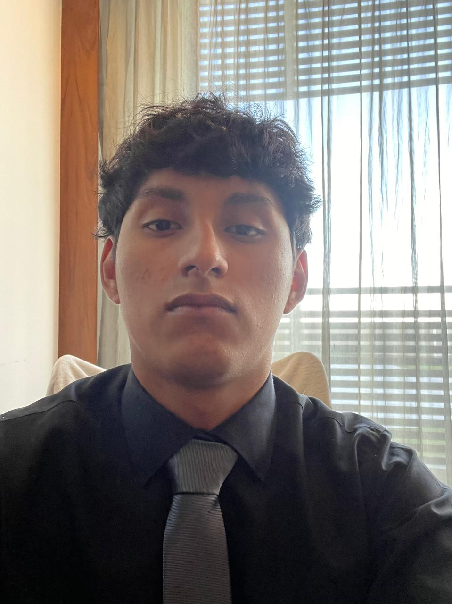

# **Pagina Bitacora**

# Integrantes de equipo:

## 1.- Abraham Domínguez Noda

  

### Descripción personal

- **¿Quién soy?**
     * Me llamo Abraham Domínguez Noda, tengo 17 años
- **Lugar de origen:**
     * Vengo del Estado de México
- **Intereses**
     * Me gusta la tecnología
- **¿De que me enorgullezco?**
     * Estoy orgulloso de haber hecho sin ayuda nada más que de TikTok, haber hecho un circuito con focos leds que tengan la funcion de ser unas direccionales, intermitentes, faros, altas y calaberas; además le puse un motor electrico ya que este solo contaba con uno "Pull and back".
- **¿Qué estudio?**
     * Ingenieria Mecatrónica.
- **Me puedes localizar en:**
   *203599@iberopuebla.mx*

---
## 2.-José Gil González Berra

### Descripción personal

- **¿Quién soy?**
     * Me llamó José Gil González Berra, tengo 17 años 
- **Lugar de origen:**
     * Tabasco
- **Intereses**
     * Me gusta la tecnología
     * Me gustan los videojuegos
     * Mi deporte favorito es el futbol
- **¿De que me enorgullezco?**
     * Tener un promedio de 9.8 de preparatoria
     * De estar en la IBERO
- **¿Qué estudio?**
     * Ingenieria Mecatrónica.
       
- **Me puedes localizar en:**
     *203536@iberopuebla.mx*
